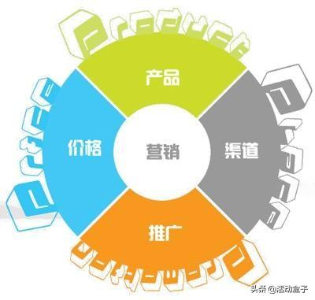

# 4P营销理论模型

4P营销理论产生于20世纪60年代的美国，在营销领域，这种以市场为导向的营销组合理论，被企业应用最普遍。
可以说企业的一切营销动作都是在围绕着4P理论进行，也就是将：产品、价格、渠道、推广。
通过将四者的结合、协调发展，从而提高企业的市场份额，达到最终获利的目的。

***OPPO为例***

## 产品
对于消费者来说，解决痛点的产品就是好产品。

OPPO的产品策略就是不断满足消费者更高需求，直击痛点。
“充电五分钟，通话两小时”、“这一刻，更清晰”的广告语就很好的体现出这一点。

## 价格
OPPO在价格的整体策略上市全国统一、严控价格，这种策略不会造成不同渠道的不同价格，某种程度上也限制了线上渠道。
如果线上线下同价，消费者更愿意去实体店进行体验后购买，当然了这种方式有利于公司对价格进行管理，
另一方面这也使得消费者安心，虽然没有优惠感，但同样也没有吃亏，反倒会对品牌多了一份信任。

## 渠道
OPPO的渠道趋于扁平化，“OPPO—省代—代理商—用户”，这其中OPPO对渠道合作伙伴以一种捆绑的方式合作，一些合作伙伴持有公司股份。
那么这会让渠道伙伴更加用心更尽力去销售，同样也是与渠道伙伴建立高度的信任，并在经历波动时能稳固地生存下来。

## 促销

OPPO的营销推广策略是：
大力的宣传、大幅地出镜，让消费者不用费力地寻找信息，而是触手可得的接受，并且这个接受还是主观的愿意接受。
典型的是邀请大量当红偶像为品牌代言，赞助多档热播综艺等。
