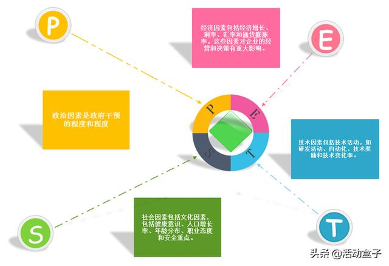

# PEST

指宏观环境的分析，宏观环境又称一般环境，是指一切影响行业和企业的宏观因素。
对宏观环境因素作分析，不同行业和企业根据自身特点和经营需要，分析的具体内容会有差异，
但一般都应对四大类影响企业的主要外部环境因素进行分析。

PEST要求高级管理层具备相关的能力及素养。
PEST作为企业与环境分析的基础工具，与外部总体环境的因素互相结合就可归纳出SWOT分析中的机会与威胁。

## 政治（Political）
## 经济（Economic）
## 社会（Social）
## 技术（Technological）
