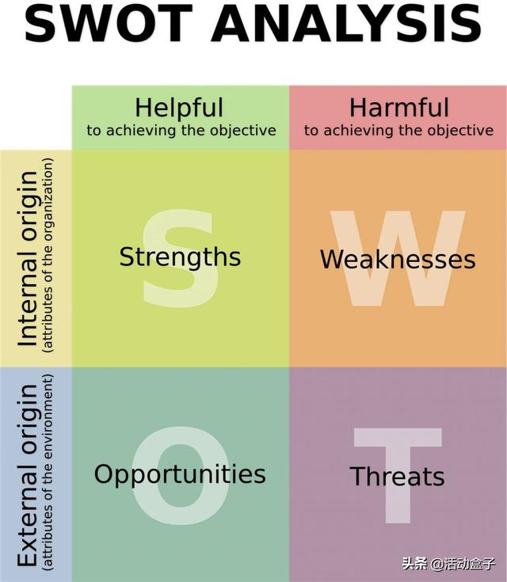

# SWOT

也称TOWS分析法、道斯矩阵，即态势分析法。

SWOT分析法是用来确定企业自身的竞争优势、竞争劣势、机会和威胁，
从而将公司的战略与公司内部资源、外部环境有机地结合起来的一种科学的分析方法。

可以对研究对象所处的情景进行全面、系统、准确的研究。

通过分析研究对象密切相关的各种主要内部优势、劣势和外部的机会和威胁等，
从而得出结论，这个结论通常带有一定的决策性。
可以根据结论制定相应的发展战略、计划以及对策等。

## S （strengths）是优势

## W （weaknesses）是劣势

## O （opportunities）是机会

## T （threats）是威胁或风险
