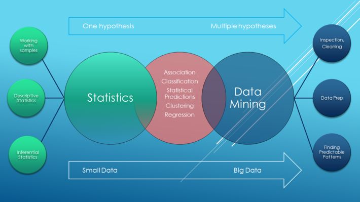

# What Is Data Mining? 

一个跨学科的计算机科学分支，它是用人工智能、机器学习、统计学和数据库的交叉方法在相对较大型的数据集中发现模式的计算过程。  

## 数据挖掘过程的总体目标

是从一个数据集中提取信息，并将其转换成可理解的结构，以进一步使用。
除了原始分析步骤，它还涉及到数据库和数据管理方面、数据预处理、模型与推断方面考量、兴趣度度量、复杂度的考虑  
以及发现结构、可视化及在线更新等后处理。  
数据挖掘是“数据库知识发现”（KDD）的分析步骤。  

## 算法选择的基本原则  

没有最好的算法，只有最适合的算法，算法选择的原则是兼具准确性、可操作性、可理解性、可应用性。  
挖掘算法最难的是算法调优，同一种算法在不同场景下的参数设定相同，实践是获得调优经验的重要途径。  
    
## 在数据挖掘阶段，数据分析师要掌握数据挖掘相关能力  

一是数据挖掘、统计学、数学基本原理和常识
二是熟练使用一门数据挖掘工具，Clementine、SAS或R都是可选项，如果是程序出身也可以选择编程实现
三是需要了解常用的数据挖掘算法以及每种算法的应用场景和优劣差异点

## KDD（Knowledge Discovery in Database）  

是从数据集中识别出有效的、新颖的、潜在有用的，以及最终可理解的模式的非平凡过程。  

相对来讲，数据挖掘主要流行于统计界（最早出现于统计文献中）、数据分析、数据库和管理信息系统界；  
而知识发现则主要流行于人工智能和机器学习界。  

## CRISP-DM ("跨行业数据挖掘标准流程)  

是一种KDD过程模型，在各种KDD过程模型中占据领先位置。  

1. 业务理解（business understanding）  
2. 数据理解（data understanding）  
3. 数据准备（data preparation）  
4. 建模（modeling）  
5. 评估（evaluation）  
6. 部署（deployment）  
  即将其发现的结果以及过程组织成为可读文本形式。  

事实上，就方法学而言，CRISP-DM并不是什么新观念，本质来看就是在分析应用中提出问题、分析问题和解决问题的过程。  
而可贵之处在于其提纲挈领的特性，非常适合工程管理，适合大规模定制，以至CRISP-DM如今已经成为事实上的行业标准，  
“调查显示，50%以上的数据挖掘工具采用的都是CRISP-DM的数据挖掘流程"。  

##  vs 统计学

